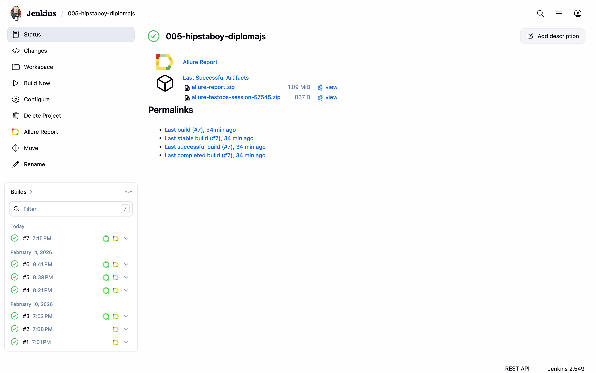
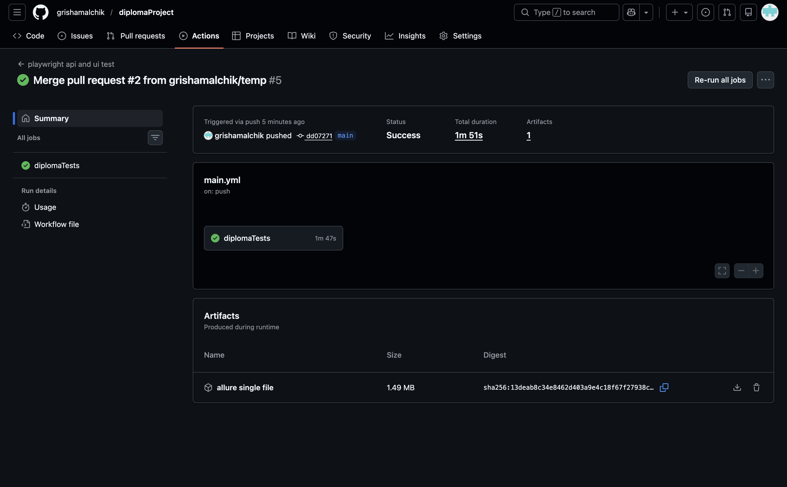
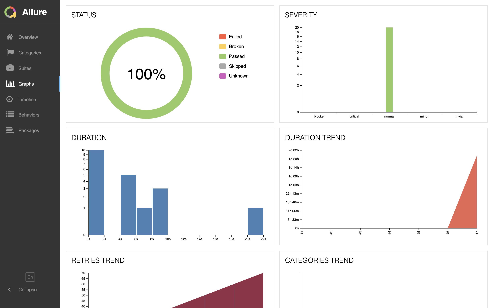
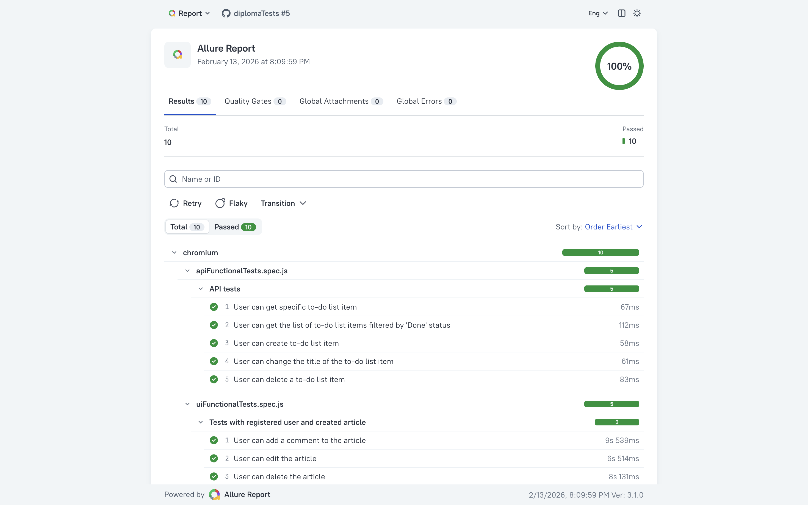
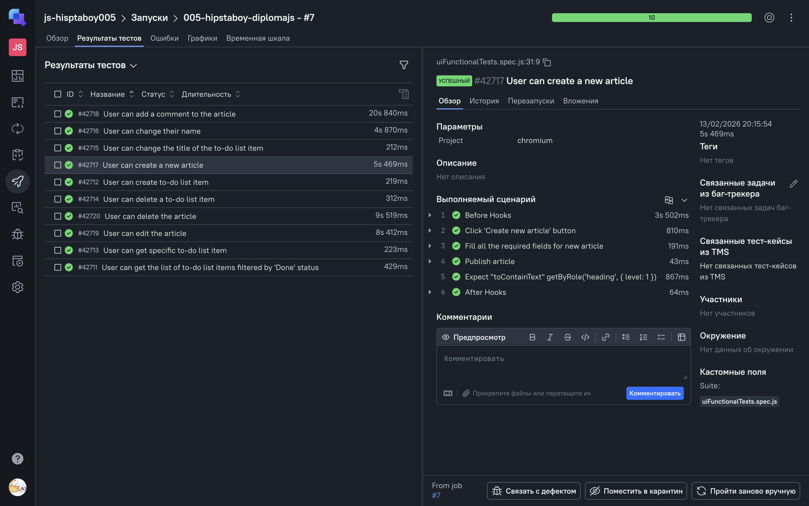
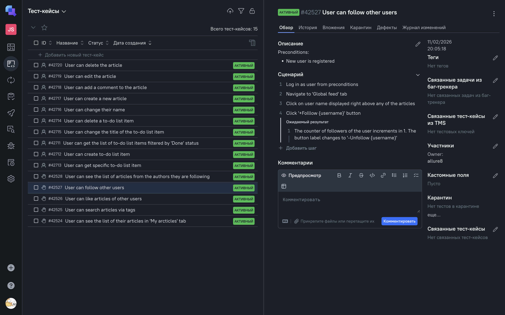
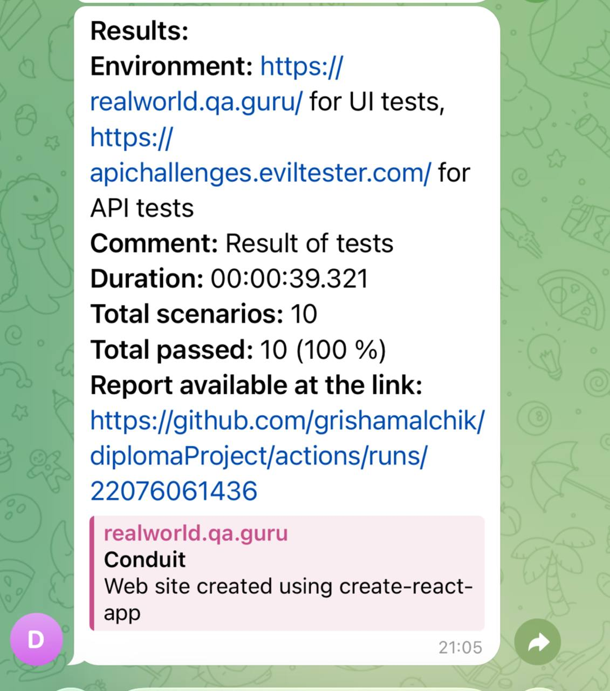

<h1 align="center">Diploma Project: UI and API Test Automation with Playwright</h1>

<p align="center">
  
  
  
  
  
</p>

## 📋 Table of Contents

- [Description](#description)
- [Technologies and Tools](#technologies-and-tools)
- [Project Architecture](#project-architecture)
- [Environment Setup](#environment-setup)
- [Running Tests](#running-tests)
- [Jenkins Build](#jenkins-build)
- [GitHub Actions](#github-actions)
- [Allure Report Integration](#allure-report-integration)
- [Allure TestOps Integration](#allure-testops-integration)
- [Telegram Notifications](#telegram-notifications)

---

## Description

A diploma project for test automation, including **UI** and **API** tests.

**UI Tests** — 5 functional automated tests for [Conduit](https://realworld.qa.guru/) application (article publishing platform).

**API Tests** — 5 functional automated tests for [API Challenges](https://apichallenges.eviltester.com/) service.

**Manual Test Cases** — 5 test cases for Conduit, documented in Allure TestOps.

---

## Technologies and Tools

<div align="center">
  
  
  
  
  
</div>

<br/>

| Tool | Purpose |
|------|---------|
| **Playwright** | UI and API test automation framework |
| **JavaScript** | Programming language |
| **Faker.js** | Test data generation |
| **Allure Report** | Test results visualization |
| **Allure TestOps** | Test management system |
| **Jenkins** | CI/CD server |
| **GitHub Actions** | CI/CD platform |

---

## Project Architecture

```
diplomaProject/
├── src/
│   ├── pages/              # Page Object classes (UI)
│   ├── services/           # Service Object classes (API)
│   └── helpers/
│       ├── builders/       # Builder pattern for test data
│       └── fixtures/       # Playwright fixtures
├── tests/
│   ├── uiFunctionalTests.spec.js
│   └── apiFunctionalTests.spec.js
├── notifications/          # Telegram notifications configuration
└── playwright.config.js
```

**Design Patterns Used:**
- **Page Object Model** — for UI tests
- **Service Object Model** — for API tests
- **Builder Pattern** — for test data generation
- **Fixtures** — for reusable test setup

---

## Environment Setup

### Installing Dependencies

```bash
npm install
npx playwright install --with-deps
```

### Environment Variables

The project uses environment variables for configuring test URLs. By default, tests use:
- **BASE_URL**: `https://realworld.qa.guru/` (for UI tests)
- **API_URL**: `https://apichallenges.eviltester.com/` (for API tests)

To override these values, create a `.env` file in the project root:

```bash
cp .env.example .env
```

Then edit `.env` and set your custom URLs:

```
BASE_URL=https://your-custom-ui-url.com/
API_URL=https://your-custom-api-url.com/
```

> **Note**: The `.env` file is ignored by Git. Use `.env.example` as a template.

---

## Running Tests

### Run All Tests

```bash
npm test
```

### Run in UI Mode

```bash
npm run ui
```

### Generate Allure Report

```bash
npx allure generate --clean
npx allure open
```

---

## Jenkins Build

The project is configured to run in Jenkins CI/CD environment.

🔗 **[View Jenkins Job](https://jenkins.autotests.cloud/job/005-hipstaboy-diplomajs/)**

To access Jenkins, register on the [Jenkins](https://jenkins.autotests.cloud/) platform.

To start a build, click the **Build now** button.

<p align="center">
  
</p>

After the build is complete, the **Allure Report** icon will appear in the **Build History** section for viewing detailed reports.

---

## GitHub Actions

Tests are automatically triggered by:
- Push to `main` branch
- Manual run (workflow_dispatch)

### Workflow Steps:

1. **Checkout** — clone repository
2. **Setup Node.js** — install Node.js
3. **Install packages** — install dependencies (`npm ci`)
4. **Install browsers** — install Playwright browsers
5. **Run tests** — execute tests (`npm t`)
6. **Generate Allure report** — generate single-file report
7. **Upload artifacts** — save reports as artifacts

<p align="center">
  
</p>

---

## Allure Report Integration

Two versions of Allure are used in this project:
- **Allure 2** — in Jenkins (classic report)
- **Allure 3** — in GitHub Actions and locally (new interface)

### Allure 2 (Jenkins)

<p align="center">
  
</p>

### Allure 3 (GitHub Actions / locally)

<p align="center">
  
</p>

---

## Allure TestOps Integration

Test results are automatically sent to [Allure TestOps](https://allure.autotests.cloud/).

<p align="center">
  
</p>

### Manual Test Cases

<p align="center">
  
</p>

---

## Telegram Notifications

After the build is complete, a Telegram bot automatically sends a message with test results.

<p align="center">
  
</p>

---

